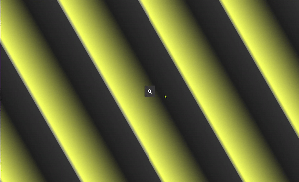

<h1 align="center">  Hidden Search </h1>

 This project is part of 50 Projects in 50 days. 

I decided to add a background with the CSS function repeating-linear-gradient()

## Build With

- [HTML](https://developer.mozilla.org/en-US/docs/Web/HTML)

- [CSS](https://developer.mozilla.org/en-US/docs/Web/CSS)

- [JavaScript](https://www.javascript.com/)

## Check how it looks! 👀

 

